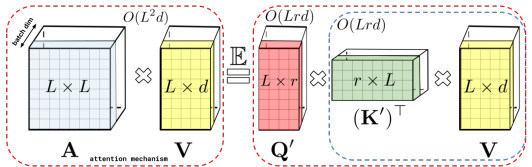

# Performer a linear attention mechanism developed by Deepmind, Google, Cambridge, ATI
This repository is implementention of Performer by tensorflow 2.x [See Paper](https://arxiv.org/abs/2009.14794)

This repo provides a layer which computes source-target attention in O(L) time and space by utilizing kernel trick where L is the length of the input sequence.

This layer can easily be used for traditional transformer mechanism instead of existing softmax attention layer which needs O(L^2) time and space.
See paper for detailed mechanism.
